# Journal

This "design journal" is made up of posts I wrote on my public-facing blog while making *GuruQuest*.

## Down in the depths (2011-03-13)

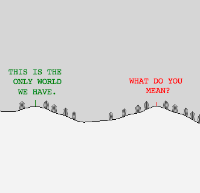

Continuing on from yesterday, I&#8217;ve been working away on this little procedural world quietly. I did indeed find a library for Processing that can run the ELIZA chatbot program, and I&#8217;m integrated that into the simulation. So now you can run into a green guy who you can then have  a conversation with by typing. And the conversation is an ELIZA conversation.

As with so many programming tasks, this stupidly easy little thing has taken quite a bit of work over the day. Not least of all because it turns out that the ELIZA library didn&#8217;t quite output its text in a format that I liked (weird spaces between certain characters). Amazingly (to me), I ended up grabbing the source code for the library and then spent a long while deciphering it in order to get rid of the spaces, recompile it, and use my new version of the library.

It&#8217;s one of those fascinating things about programming specifically that you end up with the insane gulf between what pops out at the end (a little scene with hills and trees and a person you can type to talk to) and what had to happen to make it appear (a lot of my own code, a tweaked and recompiled library, a heavily edited chatbot script, and so on). This is probably true of most arts/crafts &#8211; the level at which the creator engages with the tools is more or less invisible to us when we see the output, and yet it&#8217;s that engagement that yields the thing in the first place.

Anyway, this sketch is now tentatively going to be called GuruQuest and is going to feature the player walking through a barren landscape seeking a guru to explain the meaning of existence and solve all their problems. I like the idea that this will be something I can add to over time (I&#8217;d quite like some clouds, maybe some wildlife, maybe some urban settings eventually), but right now I&#8217;m trying to establish the major function &#8211; walk through a landscape, find and talk to a guru (randomly positioned right now, but hopefully on a mountaintop!).

As with most of the things I find interesting, there&#8217;s no real win state or solution &#8211; you go find the guru, talk to him, get what you get, and then (perhaps, in a later iteration), go home.

## In conversation with my guru (2011-03-15)

And by my guru, I mean _my guru_. As in, I made him myself. I&#8217;m still working on my _GuruQuest_ game and this evening that&#8217;s meant editing away at the ELIZA script to move it from psychotherapy to gurudom. It&#8217;s been pretty hilarious, but also a rather tough writing challenge. I&#8217;m trying my best to walk a line between kind of clichéd guru-stuff, but also trying to capture some amount of resonance for people who might actually want to take it moderately seriously.

Frankly, I&#8217;m a big fan of the mystical art of guruspeak anyway &#8211; the Tao Te Ching is a favourite book of mine, with its paradoxical sentences and existentially booming one-liners. It&#8217;s a great mode of expression that&#8217;s simultaneously a parody of itself, and extremely insightful and deep at the same time.

Can I write a chatbot script that achieves guru status? Well, here&#8217;s a transcript of a conversation I just had with GuruBot 1.0:

> **Me**: I have travelled far. Are you a guru?

> **Guru**: Who can say whether they are a guru or not?

> **Me**: Then you are surely a guru.

> **Guru**: Be uncertain.

> **Me**: Really?

> **Guru**: This is the only world we have.

> **Me**: There is no other?

> **Guru**: Be uncertain.

> **Me**: You already said that.

> **Guru**: You may continue.

> **Me**: What should I say?

> **Guru**: Yes, what should you say.

> **Me**: Help me.

> **Guru**: Go on.

> **Me**: I&#8217;m worried about the meaning of life.

> **Guru**: Speak.

> **Me**: Is it all just a cosmic joke?

> **Guru**: Recite.

> **Me**: Is there meaning in anything?

> **Guru**: Do you hear the wind in the trees?

> **Me**: Yes&#8230;

> **Guru**: Is it Autumn?

> **Me**: No, it&#8217;s Spring.

> **Guru**: Perhaps.

> **Me**: I&#8217;m pretty sure it&#8217;s Spring.

> **Guru**: A rabbit knows that it runs.

> **Me**: Does it?

> **Guru**: A dog knows that it barks.

> **Me**: Okay.

> **Guru**: A sleeper knows that he sleeps.

> **Me**: I&#8217;m not so sure.

> **Guru**: Well?

> **Me**: Well what?

> **Guru**: Why ask?

> **Me**: Why indeed?

> **Guru**: And?

> **Me**: Nothing.

> **Guru**: This.

And on and on and on. He&#8217;s an indefatigable guru. He&#8217;s a machine.

## Guru: The Quest Continues (2011-03-19)

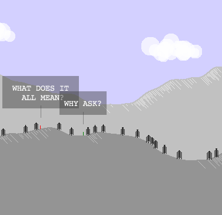

Continuing to work on the code for _GuruQuest_ this weekend. The screenshot here gives you the lastest idea of how it&#8217;s looking. Which is to say that I think it&#8217;s improving aesthetically at least, which is encouraging.

Development kind of oscillates between two different poles. On the one hand I keep trying to think about the overall experience of what it&#8217;ll be like to play around with this, and that leads me to focus more on getting the guru script right and to fret about how boring the world could be. Then on the other hand I become obsessed with the weirdness of generating a world essentially out of a single number, thanks to Perlin noise.

So basically the world is generated by using the wonderful pseudorandomness of Perlin noise. That draws the shape of the foreground landscape, the paralaxing landscape in the background, and the shapes of the clouds in the sky. It may also stretch to some generated birds to fly around at some point, too.

The central idea behind using Perlin noise is that it&#8217;s a pseudorandom number generator that&#8217;s _repeatable_. Which means that the world isn&#8217;t totally random, it stays the same once it&#8217;s generated. So you can walk for &#8220;miles&#8221; in either direction, but when you come back, the landscape will be the same one you left. I wanted to have a consistent world and large world, you see, but didn&#8217;t want to draw it myself in any more conscious way. So the &#8220;noise&#8221; approach worked out really well on that front.

Overall the project is pushing every so slightly closer to being something I could imagine actually giving someone to play with. The major things I want to get done is some kind of &#8220;zoom&#8221; if as all possible, so you could view the world either from this more meditative distance, or up close, and that it would be the same basic generation code either way. And I want to the player to be able to adopt &#8220;mediation&#8221; poses, as well. Long term I have a vague idea fleshed out with Rilla about a multiplayer version of the world.

It&#8217;s fun, exhausting, and endless. But what does it all mean?

## Games as Research (2011-03-21)

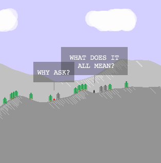

As I continue work on _GuruQuest_ (latest graphical state visible in the screenshot to the left, with proper clouds!), I&#8217;ve been trying to think about what I&#8217;m actually doing with it. I have this vision of it that revolves around a virtual contemplative space, and the ability of a computer to tirelessly generate a world and a person for you to talk to, and the idea that you get out what you put in &#8211; there&#8217;s no reason you can&#8217;t have a meaningful experience with the virtual guru, to my mind, you&#8217;d just have to want to.

Anyway, this gets toward thinking in the world of design concerning design &#8220;as&#8221; research versus design &#8220;for&#8221; research. The distinction being, at base, whether you make your design and then look at it afterwards and try to learn something; or whether you go into your designing with a kind of project in mind. It seems like the former makes pretty good sense, while the latter could pretty obvious compromise the over design process in various ways, and so could be flawed.

But in a sense all design (including game design) could be seen as &#8220;for&#8221; research in the sense that we&#8217;re usually exploring something while we&#8217;re designing/making. There are certain qualities we&#8217;re interested in, and as we make the thing we&#8217;re making, we learn about them.

So, by making _GuruQuest_ I&#8217;m able to actively experiment with these ideas of a generated &#8220;natural&#8221; world and a person who behaves like a guru, and so on &#8211; and I can ask the central question &#8220;what&#8217;s it like?&#8221; because I can actually make the experience personally. Obviously it might turn out that it feels like &#8220;not much&#8221;, but the ability to ask the question is kind of miraculous in itself.

On the other hand, there&#8217;s something about games in this regard that&#8217;s a bit painful. Specifically, games require _so much effort_ to produce. Just to make something as simple as _GuruQuest_ has taken me a significant amount of effort. I&#8217;m not the world&#8217;s greatest programmer by any stretch, but being a better programmer would only help a bit &#8211; the fact is that making a game is just a major undertaking. And that, it seems to be, is kind of inherently opposed to the idea we could experiment with and explore ideas and experiences with games. It seems to me that, at least for me personally, you can&#8217;t just make a game as a throw-away experiment with an idea, just to see what happens.

Or rather, more importantly, you can&#8217;t make _lots_ of games in that manner, to find out a lot of information about what games (your games) do. Unless you&#8217;re [Cactus](http://cactusquid.com/), obviously.

In addition to the &#8220;making one game is hard work&#8221; conundrum, there&#8217;s perhaps a larger oddity, which is that I think games themselves are kind of hard to &#8220;play around with&#8221; in the sense of design. Because they&#8217;re generally quite complex systems of relationships, variables, parameters, graphics, sounds, and on and on, it can become quite difficult to tweak and mess with your game in a meaningful way. Either you change something tiny and get a tiny effect, or you tweak something larger and generally break everything &#8211; because the game is the system itself, and the system (unlike its parameters, individual rules, etc.) is somewhat resistant to change.

Which makes it all sound hopeless in a way, but it isn&#8217;t. The main thing is for more people to make games, particularly those of us who probably wouldn&#8217;t otherwise. We might do something new! We might do something stupid and new!

Yesss!

## Pagodas! Pagahdas! Let's Call the Whole Thing Off! (2011-03-24)

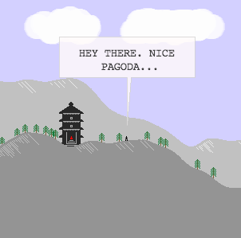

In my continuing sub-career as a game designer of no repute, I&#8217;ve been working on &#8220;procedural pagodas&#8221; for my fledgling game _GuruQuest_. Much as I enjoyed having the titular guru just kind of sitting on a hill (or in a valley, or wherever), it didn&#8217;t have a lot of pop, so I decided he needed to be sitting in a stylish pagoda &#8211; and now he does, as per the screenshot.

Still, this obsessive fiddling with the aesthetics of the game is only going to take me so far. And it may have taken me a little too far away from ever actually finishing what the game is meant to be. As it stands, the game is mechanically very similar to super early prototypes &#8211; you can walk along its infinite landscape, find the guru (in his pagoda!) and talk to him.

There are numerous things I need to do far more than whatever the latest &#8220;pagoda idea&#8221; will be. I need to make the guru&#8217;s script quite a bit stronger (though it&#8217;s currently pretty nice). I need to create some kind of &#8220;spatial narrative&#8221; for the world &#8211; specifically, I want to have the player &#8220;leave home&#8221; at the beginning, walk to find the guru, and then return home, satisfied or not.

Further along, I want to implement the idea of a &#8220;guru battle&#8221; which would allow the player to take the place of the guru by &#8220;out-guruing&#8221; him (or her). That will actually be comparatively easy to implement, but possibly _very_ hard for the player to achieve, so will have to look at how to tune it down a bit.

The main thing, though, is to choose some sort of end state. This project wasn&#8217;t meant to take a lot of time, and there are numerous other ideas I want to get a chance to play around with. Even in the throes of poor project management, though, I find it kind of fun to be in the throes of poor project management for a _game_. It&#8217;s novel and oddly pleasant. Still, I&#8217;ll make a list of required features and work on implementing them and releasing the game into the tiny wild of people I know.

Like you.

## Making Ugly Music Alone (2011-03-29)

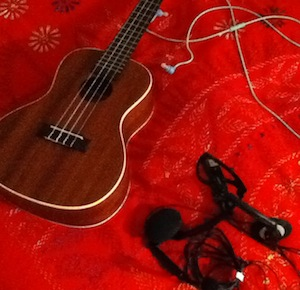

Just finished up a deeply dispiriting session in which I tried to produce some music effects for _GuruQuest_ in the continuing tradition of doing everything for the game myself. The basic idea was sound, I think, but the execution and everything else was oh so disappointing.

The plan was to record chords from the C major progression and then have the game play them at some kind of random interval during play to create a bit of a mood and, most importantly really, just a little bit of sound texture to an otherwise soundless world. Anyway, in my mind at least, this would create a series of sounds that would be compatible with each other, but also randomly selected, in keeping with the &#8220;generated&#8221; idea behind the game as a whole.

But instead I got a big taste of the experience of wading into into the unknown realms that stretch as far as the eye can see outside my limited expertise. See, I can do some programming, and on a good day I&#8217;ve got an alright eye for visual aesthetics, but on the sound front? Well, I can plink away at a ukulele and I know the bare minimum about sound programming, and that&#8217;s that.

Recording music is really hard. I guess that&#8217;s why there are highly paid professionals and, importantly, special rooms. My setup was a noise cancelling mic (tuned for human speech presumably), my laptop (with its fan noisily running because it&#8217;s an old fellah these days), and my ukulele. This did not turn out to be the best audio setup one could hope for. But I forged on and learned various things about the proximity of the instrument to the microphone and so on. Then I learned how the noise-cancellation algorithm in Audacity (the sound editing software) can make the ukulele sound bizarrely terrible. So that wasn&#8217;t great.

After many painful run-throughs, I ended up with sound files for each of the chords in the progression. They had a bit of background hiss, but not so much to be totally noticable, so I wasn&#8217;t completely unhappy. Then I tried installing some sounds in the game world so that a random chord would play every four seconds or so.

And _then_ I was completely unhappy.

It sounded so very terrible. Not so much because of the sound quality, which was passable, but because the pairing of the (medium speed) chords and the still, clean aesthetic of the game was wretched. I don&#8217;t think I&#8217;ve  felt such a jarring dislike of something I&#8217;ve made in a long time.

Of course, the flip side of &#8220;oh god, that&#8217;s awful!&#8221; is a heapin&#8217; helpin&#8217; of learning. Clearly if the ukulele thing is going to work the chords need to be much slower (more like individual notes) and much softer. It _might_ stand a chance of working. So I&#8217;ll have to re-record it all and keep my chin up and so on. And, at the very least, beneath the sadness and despair, at least I _did_ the thing I was thinking of and found out it sucked, rather than blithely assuming it would be fine later, later.

Anyway, much respect to all you proper music and audio people out there &#8211; I very literally don&#8217;t know how you do it.

## Finishing Touches (2011-04-09)

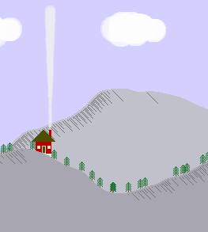

I&#8217;ve spent a fair bit of today working on _GuruQuest_ despite the irritatingly persistent cold I&#8217;m still battling with. The cold has prevented me from doing terribly well with one or two more &#8220;mathematical&#8221; issues, but by and large I&#8217;ve made quite a bit of progress toward the goal of finishing my first &#8220;game&#8221;.

At this point, it&#8217;s heading toward &#8220;feature complete&#8221; for the reasonably small set of features I&#8217;ve wanted it to have. Specifically, you start off in your little house (visible in the screenshot), you leave home to go and consult the guru, you talk to him. At that point you can either leave (because he solved all your problems, say, or none) and go home &#8211; or you can try to &#8220;outguru&#8221; the guru. If you outguru him, then you replace the guru and the game ends. If you go home, the game also ends. So those are your two end states. Throughout, charming, home-spun ukulele music plays.

All of that is implemented now, and most of what remains is more on the interface end &#8211; trying to make the game playable for someone who might encounter it without me breathing down their neck and muttering about what it all means. There are a few more of those things to do, essentially little tutorial elements, but also a return to working on the guru script. After that&#8217;s all good enough, hopefully in a few days, I&#8217;ll have to test it with some people, and then perhaps release _GuruQuest_ into the wild, whatever that may mean.

It&#8217;s come a long way since I began roughly a month ago, give or take. It&#8217;s also really interesting just to try and finish a game project like this. I haven&#8217;t worked on something so substantial for a long time, and the overall process has actually been very rewarding. Definitely learned quite a bit about producing a game-like thing and, maybe most important, about the complexities and endless details of really _finishing_ a game. It many ways it&#8217;s been the antithesis to how I ordinarily go about making something &#8211; I&#8217;d usually just dash off a comic or poem or whatever without giving it much thought at all&#8230; straight from brain to page. That doesn&#8217;t work at all with a game, needless to say.

Anyway, here&#8217;s to the guru and his eventual release into the world where he will inevitable solve everyone&#8217;s problems. Even yours. Even mine.

## GuruQuest hits pre-alpha (or something else official-sounding) (2011-04-14)

So _GuruQuest_ passed the all-important &#8220;I can send it to someone and ask them to play&#8221; milestone today. I finally bolted on enough interface stuff and hacked away at the script enough that it&#8217;s a playable game. Immediately after sending it to a chosen couple of people I felt super depressed about the entire enterprise, as is only right when &#8220;finishing&#8221; something like this.

The whole process has been so much longer than I&#8217;m used to that it&#8217;s amazing to me I persevered. If nothing else, I feel it bodes well for future game-making endeavours. I&#8217;m planning on writing some form of post-mortem later in the week, but for now thought I&#8217;d just post some chronological screens from the game to at least indicate its aesthetic development.

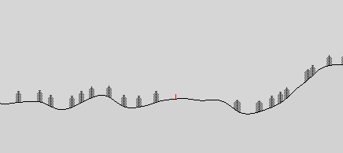

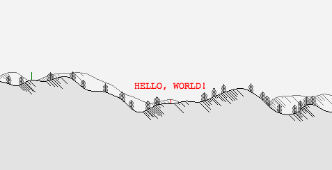

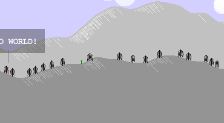

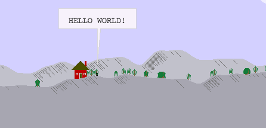

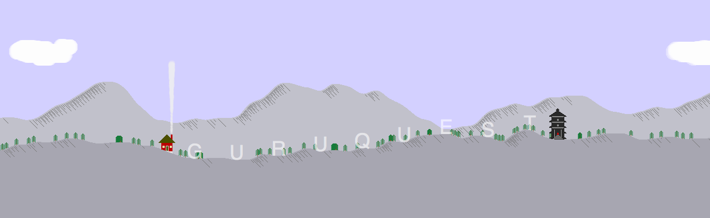

## GuruQuest (Pre-)released (2011-05-02)

I have officially released _GuruQuest_ into the wild. You can go look at its ~~[page on stimulusresponse](http://www.pippinbarr.com/art/2011/05/02/guruquest/)~~, or you can just download the appropriate version from here if you&#8217;re so eager to play it you can&#8217;t possibly click on one extraneous link: ~~[Mac](http://www.pippinbarr.com/games/guruquest/GuruQuestMac.zip "GuruQuest for Mac"), [Windows](http://www.pippinbarr.com/games/guruquest/GuruQuestWindows.zip "GuruQuest for Windows"), and [Linux](http://www.pippinbarr.com/games/guruquest/GuruQuestLinux.zip "GuruQuest for Linux").~~

It&#8217;s really my first &#8220;proper&#8221; game and I&#8217;m very curious to know what you think of it, so I welcome feedback, both here on the blog and in any old email, tweet, or whatever you might want to send. Obviously, I know that downloading something and double-clicking on it and so on is deeply arduous, so I won&#8217;t hold it against you if you don&#8217;t bother. Though of course we could no longer be friends after that had happened. So if you&#8217;re fine with that, then, you know, whatever.

## The Tyranny of Action (2011-05-10)

In keeping with yesterday&#8217;s post about game criticism from the developer&#8217;s end I was thinking about&#8230; game criticism from the developer&#8217;s end. In particular, while I often think about games from the perspective of &#8220;what can I do?&#8221; and thus constantly press on trying to _make something happen_ when I play, it&#8217;s not often I query what that means from the side of making a game.

And then I made _GuruQuest_ and had enough people take a look at it that I felt like I was being forcefully oppressed by &#8220;action&#8221;. A number of people played _GuruQuest_ bringing the traditional (and perhaps reasonable) gamer-view that everything has a purpose and you&#8217;re out to _do something_. Thus, they ran around on the terrain, becoming distraught when there was nothing to see off in the distance.

When they eventually talked to the guru, they were frustrated they weren&#8217;t able to ascertain the _point_ of talking to him. Thinking of him in terms of an NPC from another game, they figured he&#8217;d lead them on to the next _thing to do_ in the world, and when he was oblique and sometimes just nonsensical, players felt that there was something quite simply wrong.

Putting aside the irony involved in meeting and talking to a (virtual) guru and going &#8220;well what was the point of that?&#8221;, this is a very real element of games that I feel we&#8217;re being locked into. Contemplation, and even just allowing nothing to happen for a time, just isn&#8217;t something that&#8217;s being overly encouraged. Sometimes you can carve it out for yourself, perhaps stand looking out on a vista in _Fallout 3_, but often a radscorpion comes to remind you you&#8217;re a man/woman of action. Some games, of course, take inaction to various logical extremes, like Bogosts _Guru Meditation_ or Frasca&#8217;s _September 12th_, and that&#8217;s pretty cool too.

But I&#8217;d like to see at least a little spike of interest in games (and perhaps they aren&#8217;t games at all, by definition) that don&#8217;t have you &#8220;getting somewhere&#8221; all the time. Where you might take actions, big or small, that aren&#8217;t wired into a larger system. Something like _Minecraft_ exhibits this a little, but ultimately you end up slotting the possible actions and outcomes into a fairly easily constructed framework of &#8220;good&#8221; and &#8220;bad&#8221; and so on. A game like _Rez_, perhaps, despite its overt frenzy of action, lends itself a bit to a serene nothingness at the same time.

At any rate,  it would be nice to play some more games where you don&#8217;t inevitably ask yourself, &#8220;am I getting somewhere? Am I doing good?&#8221; Any recommendations?
